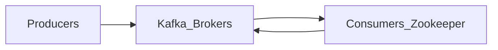

# Code Flow
1. Load the Dataset
   1. Using `tf.data.experimental.make_csv_dataset`
2. Split the dataset 
   1. Training
   2. Validation
3. Create ANN with Tensorflow API
4. Train model with Training Dataset
5. Evaluate model with Validation Dataset 

# Data Input

## Data Flow

PCAP -> XML -> NPY

# Search Thread/References

- https://www.phind.com/search?cache=b2398b4f-4454-41b1-8560-897892b84909&init=true
- https://github.com/rodrigo-arenas/kafkaml-anomaly-detection
- https://www.phind.com/search?cache=cf139efb-38e8-4fb5-9cda-5c67194a11a6

# Kafka Explained

### How to use Kafka

Sure. Kafka is a distributed streaming platform that can be used to process and store large amounts of data. It is often used for real-time streaming applications, such as streaming data from sensors or social media feeds. Kafka can also be used to store data for later analysis.
The main components of Kafka are:
1. Producers: Producers are responsible for sending messages to Kafka.
2. Brokers: Brokers are servers that store messages in Kafka.
3. Consumers: Consumers are responsible for reading messages from Kafka.
4. Zookeeper: Zookeeper is a coordination service that helps Kafka brokers stay in sync.

To use Kafka, you first need to create a topic. A topic is a logical grouping of messages. You can create as many topics as you need.
Once you have created a topic, you can start producing and consuming messages. To produce a message, you use a producer client. To consume a message, you use a consumer client.
Producer clients and consumer clients are available for a variety of programming languages, including Java, Scala, Python, and C++.

Here is a simple example of how to use Kafka:
Create a topic: `kafka-topics --create --zookeeper localhost:2181 --replication-factor 1 --partitions 1 my-topic `
Produce a message: `kafka-console-producer --broker-list localhost:9092 --topic my-topic `
Consume a message: `kafka-console-consumer --bootstrap-server localhost:9092 --topic my-topic `
When you run the producer command, you will be able to type messages. When you press Enter, the message will be sent to the Kafka broker.
When you run the consumer command, you will be able to read messages from the Kafka broker.

### Kafka Diagram


This diagram shows the main components of Kafka and how they interact with each other.
1. Producers are responsible for sending messages to Kafka.
2. Brokers are servers that store messages in Kafka.
3. Consumers are responsible for reading messages from Kafka.
4. Zookeeper is a coordination service that helps Kafka brokers stay in sync.

### Sample Code

Here is an example of how to preprocess data captured from a Kafka consumer using a Python application:
```Python
import kafka import json 

# Create a Kafka consumer 
consumer = kafka.KafkaConsumer('my-topic') 

# Read data from the Kafka consumer 
 for message in consumer: 
   # Get the data from the message 
   data = json.loads(message.value) 
   
   # Perform the desired preprocessing steps 
   # ... #
   
   # Push the data to a Kafka broker and producers 
   producer = kafka.KafkaProducer('my-other-topic') producer.send(data) 
   
   # Close the Kafka consumer 
   consumer.close() 
```
This application will read data from the my-topic topic and then perform the desired preprocessing steps. The processed data will then be pushed to the my-other-topic topic. You can use this code as a starting point for your own preprocessing application. You can modify the code to perform the desired preprocessing steps. You can also use different programming languages to write your application.

